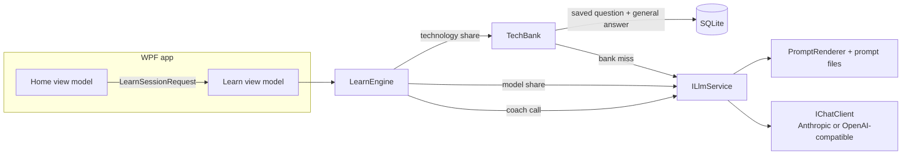

<p align="center">
  
</p>

<h1 align="center">Interview Coach</h1>

<p align="center">
  A Windows desktop app that helps you prepare for a specific job interview.<br>
  Give it a job description and your resume; an LLM writes the questions an interviewer would ask and shows you how to answer them.
</p>

<p align="center">
  
  
  
  
  
</p>

---

## Contents

1. [What it does](#what-it-does)
2. [Screenshots](#screenshots)
3. [Status and roadmap](#status-and-roadmap)
4. [Getting started](#getting-started)
5. [Using the app](#using-the-app)
6. [How it works](#how-it-works)
7. [Architecture](#architecture)
8. [Prompts](#prompts)
9. [Speed and cost](#speed-and-cost)
10. [Data, settings and privacy](#data-settings-and-privacy)
11. [Testing](#testing)
12. [Repository layout](#repository-layout)
13. [Development guide](#development-guide)
14. [Documentation](#documentation)
15. [Commit conventions](#commit-conventions)

---

## What it does

Most interview practice is generic. Interview Coach is built around **one real job**: you save a *profile* (job role, seniority,
job description, resume) and every session is generated from it.

**Learn mode** (built) picks a question an interviewer could plausibly ask for that job, then shows:

- **What they are testing**, the signal the interviewer is looking for at your level.
- **A strong answer, said out loud**, written the way a person speaks, with `[bracketed placeholders]` wherever the answer needs a
  detail only you know (a number, a name, a decision). Nothing is invented on your behalf.
- **The shape of it**, the answer's structure as a short chain of steps.
- **Where they'll go next**, likely follow-up questions; click one to see how to answer it.
- **A word count and speaking time**, next to the range interviewers typically expect for that kind of question.

Things that make it more than a question generator:

| Feature | What it gives you |
|---|---|
| **Profiles** | One per job you are preparing for. Resume and job description can be pasted or loaded from PDF, DOCX, TXT or MD. |
| **Question types** (eight per interview) | Tell me about yourself, resume deep-dive, technical concept, system design, coding talk-through, behavioral, scenario-based, plus one of *Motivation and fit* (full-time) or *Availability and engagement* (contract). |
| **Full-time or contract** | The two interview styles differ, so the role type changes which questions are offered and how they are written and coached. |
| **By technology** | Reads the technologies out of the job description (or lets you type your own under **Other**) and asks questions about the ones you pick. |
| **Saved technical questions** | Technical-concept questions and their general answers are saved per technology and seniority, so repeats cost nothing and survive edits to your resume. |
| **Tailor to my resume** | Turn any general answer into one built from your own experience, on demand. |
| **Answer length control** | Short, Medium, Long or a custom word count. By default the model aims for the same range the screen shows. |
| **Interviewer-style phrasing** | Technical questions are short and direct ("What's the difference between checked and unchecked exceptions?"), not essay prompts. |
| **Two providers** | Anthropic (default) or any OpenAI-compatible endpoint. |
| **Demo mode** | Runs the whole UI on canned data with no keys and no network. |
| **Light and dark** | Follows the Windows theme. |

## Screenshots

Rendered from the real views by the repository's own snapshot test, in Demo mode (so the text is sample data, not model output).

**Home: profile, resume, and the Start card with By technology and Other**

| Light | Dark |
|---|---|
|  |  |

**Learn mode: a general technical answer with placeholders, shape, and follow-ups**

| Light | Dark |
|---|---|
|  |  |

**Settings**


To regenerate them, see [Testing](#testing).

## Status and roadmap

| Milestone | State |
|---|---|
| 1. Skeleton: solution, DI host, encrypted settings, Demo mode, prompt files, LLM service, Test connection | Done |
| 2. Profiles: create, edit, delete; paste or load JD and resume; SQLite with migrations | Done |
| 3. **Learn mode**: question generator, coach, coach cards, follow-ups | Done |
| 4. Practice (typed): answer first, then get feedback; retry with comparison | Not started |
| 5. Voice: speech to text and text to speech (Azure, OpenAI, Windows), mic in the composer | Not started (settings and fakes exist) |
| 6. Mock Interview: planned interview, live interviewer, parallel coaching, debrief, Markdown export | Not started (prompts exist) |
| 7. History and polish | Not started |

Beyond the original spec, these were added during the build: scenario questions, answer-length control, technology bank,
By technology and Other, prompt caching and prefetching, thinking-effort setting, full-time or contract role type, a new icon and
a full visual redesign. [SPEC.md](SPEC.md) section 14 lists every change and **overrides the spec where they differ**.

## Getting started

### Requirements

- Windows 10 (version 2004 or later) or Windows 11
- [.NET 10 SDK](https://dotnet.microsoft.com/download)
- An [Anthropic API key](https://console.anthropic.com/) (or an OpenAI-compatible endpoint and key). Not needed for Demo mode.

### Run

```bash
git clone <repository-url>
cd interview-coach
dotnet run --project src/InterviewCoach.App
```

Or open `InterviewCoach.sln` in Visual Studio and run `InterviewCoach.App`.

### First run

1. Open **Settings**. Paste your API key (or set `ANTHROPIC_API_KEY` in your environment) and click **Test connection**.
   No key yet? Tick **Demo mode** (at the bottom of Settings) to try everything with sample data.
2. For a good cost/quality mix, set the **Question generator** model to Haiku, keep the **Coach** on Sonnet, and set
   **Thinking effort** to **Low**. See [Speed and cost](#speed-and-cost).
3. Go to **Home**, click **New**, fill in role, seniority, job description and resume, and **Save**.
4. Choose **Learn**, pick a role type and question types, and **Start**.

### Optional: speech keys

The speech settings are stored now and will be used when voice practice (milestone 5) arrives. With an Azure for Students
subscription, some regions are blocked by policy; if creating a Speech resource fails with `RequestDisallowedByAzure`, pick one of the
regions your subscription allows (the error lists them).

## Using the app

### Profiles

- A profile is a job you are preparing for: name, role, seniority, job description, resume.
- **Start** is disabled until the profile is saved and has a role, a job description and a resume, because a session uses the
  saved copy. Switching profile or clicking New with unsaved edits asks first.
- Loading a file over existing text asks first. Scanned PDFs with no text, old `.doc` files, corrupt files and files over 20 MB
  produce a plain message instead of a crash. Text over 40,000 characters shows a warning and a **Trim** button.

### Role type

**Full-time** adds *Motivation and fit* questions (why this company and role, where you want to grow, how you like to work) and a
broader loop: fundamentals, design and trade-offs, ownership, culture fit. **Contract** adds *Availability and engagement* questions
(start date, notice, rate, contract length, location, how you would be productive in the first week) and focuses on hands-on depth in the
exact stack, speed to productivity and delivering to a deadline. Engagement answers are kept short and direct, and the coach never
invents availability or rates; it uses placeholders such as `[your earliest start date]`. The choice is remembered between runs.

### Question types

Tick any combination, or **Any**. Each ticked type counts as one share, so with three types ticked each is picked about one time in three.
**Technical concept** and **By technology** together count as one share.

### By technology

Choose **By technology** to see the technologies found in the job description (one cheap call per distinct job description,
remembered), tick the ones you want, or tick **Other** and type names yourself (comma, semicolon or newline separated, up to eight).
Questions are then about those technologies. On its own, By technology serves only technology questions; if one cannot be produced
you see the error with **Retry** rather than a silent substitute.

### In a session

- **Next question** moves on; the following question is prepared in the background, so it usually appears instantly.
- **Back** returns to the main question after you open a follow-up.
- **Tailor to my resume** rewrites a general answer from your own experience.
- A general answer shows a note and highlighted placeholders. Replace them with your real numbers and names, or leave the claim out.

## How it works



**A question's journey.** Home builds a request (saved profile, ticked types, answer length, technologies, role type). The engine decides
whether this question comes from the **technology source** or the **model source**:

- *Technology source:* a saved general technical-concept question for the chosen technology and seniority, or one the model writes if
  every saved one has been seen this session. Its answer is a **general answer**, written without your resume or job description,
  saved, and reused at no token cost.
- *Model source:* the model writes the question from your resume and job description, and the coach answers it from the same.

Every call takes an operation id and a cancellation token; a result that arrives after you moved on is discarded. When a main
question is ready, the engine prepares the next one in the background.

**Structured output.** The model replies in JSON. The parser takes the first balanced JSON value (strings and escapes respected, so
a stray brace or commentary after the JSON is ignored) and makes **one** repair call if the reply still is not valid.

## Architecture

```
InterviewCoach.sln
  src/InterviewCoach.Core             net10.0                       engines, models, interfaces, prompt rendering. No UI, no SDKs.
  src/InterviewCoach.Infrastructure   net10.0-windows10.0.19041.0   LLM, settings, SQLite, documents, fakes. References Core.
  src/InterviewCoach.App              net10.0-windows10.0.19041.0   WPF, MVVM, Generic Host DI. References both.
  tests/                              xUnit: Core, Infrastructure, App (real views)
  tools/IconGenerator                 draws the app icon from vector shapes (not in the solution)
```

| Layer | Responsibility | Notable pieces |
|---|---|---|
| **Core** | The rules of the product, independent of any UI or vendor | `LearnEngine` (state machine, shares, prefetch), `TechBank`, `PromptRenderer`, `AnswerLength`, `QuestionTypes`, `EmploymentType` |
| **Infrastructure** | Talking to the outside world | `LlmService` on `Microsoft.Extensions.AI`'s `IChatClient`, `ChatClientFactory`, `JsonResponseParser`, `SettingsStore` (DPAPI), EF Core + SQLite repositories, `ResumeTextExtractor` (PdfPig, OpenXml), `PromptLibrary` |
| **App** | The Windows UI | MVVM with CommunityToolkit.Mvvm, `HomeViewModel`, `LearnViewModel`, `SettingsViewModel`, the design system in `App.xaml`, controls for placeholder highlighting, bindable password box, and page-first mouse-wheel scrolling |

Design choices worth knowing (the full list with reasons is in [`docs/HANDOFF.md`](docs/HANDOFF.md) section 7):

- **Core has no SDK or UI references**, so WPF or Anthropic could be swapped out without touching the engines.
- **Demo mode is a pair of decorators** (`RoutingLlmService`, `RoutingTechBankRepository`) that swap in fakes, so the real
  database and API are never touched.
- **Views are recreated on every navigation**, so view state lives in view models. For the same reason the app avoids
  `RadioButton` groups, whose state is shared between view instances.
- **No `ConfigureAwait(false)` in Core**, on purpose: engine events must arrive on the UI thread.
- **Theme colours are Fluent `DynamicResource` keys, never hard-coded**, so dark mode is correct everywhere.

## Prompts

Prompts are Markdown files in [`src/InterviewCoach.App/Prompts/`](src/InterviewCoach.App/Prompts), copied next to the executable at
build time and also embedded in Infrastructure as a fallback. You can edit the copy next to the exe to tweak wording without a rebuild.

| File | Used by | Purpose |
|---|---|---|
| `question_generator.md` | Learn; the bank when it writes a question | Writes one question; per-type length rules; role-type rule; optional focus technology |
| `coach.md` | Learn (later Practice and Mock) | Writes the answer, the shape, and the follow-ups |
| `tech_tags.md` | By technology | Extracts up to eight technologies from a job description |
| `planner.md`, `interviewer.md`, `debrief.md` | Mock Interview (milestone 6) | Present, not yet used |

`PromptRenderer` fills `{{VARIABLES}}` in a single pass, throws on a missing key, and renders a blank value as `(none)`.

**The prompts are cache-sensitive.** In `coach.md` the text before the `=== THE CANDIDATE AND THE QUESTION ===` header contains no
variables and the header appears exactly once; anything that varies per call comes after `</candidate_resume>`. Tests guard both.
Read [`docs/HANDOFF.md`](docs/HANDOFF.md) section 4 before editing a prompt.

## Speed and cost

The first version spent about **$0.067 and 20+ seconds per question**. These changes brought a warm saved question to about
**$0.017 and a reused one to about $0**, and answers from about 21 s to about 9 s:

| Lever | Effect |
|---|---|
| **Thinking effort** (Model default, Low, Medium, High) | Sonnet's default thinking produced about 2,400 output tokens for about 760 tokens of visible text. At *Low* it is about 1,000 tokens and 9-11 s. Sent for Anthropic non-Haiku models only. |
| **Prompt caching** (on by default) | The system prompt is split into cached blocks: the coach's fixed guidance, then the job description and resume. Repeat calls read them at about a tenth of the input price. |
| **Technology bank** | General answers need no resume tokens and are saved per technology and seniority, so repeats are free and edits to your resume or job description do not invalidate them. |
| **Prefetch** | The next question is prepared while you read the current one. |
| **Answer length** | Shorter requested answers mean fewer output tokens, which are most of the cost. |
| **Haiku for the question generator** | A good low-cost choice for short replies. |

Measurements came from the app's own debug log (Settings, **Debug logging**), which records seconds, tokens, cache reads and writes
for each call. Prices in the estimates are assumptions (Sonnet $3 in / $15 out, Haiku $1 in / $5 out per million tokens, cache read
about 0.1x, cache write about 1.25x). Haiku was not faster than Sonnet in practice: it wrote more and once returned invalid JSON.
Details are in [`docs/HANDOFF.md`](docs/HANDOFF.md) section 8.

## Data, settings and privacy

Everything is stored locally under `%LOCALAPPDATA%\InterviewCoach\`:

| Path | Contents |
|---|---|
| `settings.json` | Settings. API and speech keys are encrypted with **DPAPI** for the current Windows user (`dpapi:<base64>`); a test guards against plaintext keys. A corrupt file falls back to defaults. |
| `app.db` | SQLite (WAL mode): profiles, saved technical questions and answers, remembered technologies per job description. Migrations apply at startup. |
| `logs\llm-yyyymmdd.log` | Only when **Debug logging** is on. Contains full prompts and replies, **including your resume and job description**. Turn it off afterwards. |

**What leaves your machine:** your resume, job description, and the question text go to the LLM provider you configure, and nothing
else. There is no telemetry. In Demo mode nothing is sent anywhere.

**Key fallbacks** when a Settings field is empty: `ANTHROPIC_API_KEY`, `OPENAI_API_KEY`, `AZURE_SPEECH_KEY`, `AZURE_SPEECH_REGION`.

**Database tables:** `Profiles`, `TechQuestions`, `TechAnswers`, `JdTechnologies`. Learn sessions are not saved yet (History is milestone 7).

## Testing

```bash
dotnet test                                     # all 398 tests
dotnet test tests/InterviewCoach.Core.Tests     # one project
dotnet build InterviewCoach.sln -c Release      # use this if the Debug exe is running (it locks its DLLs)
```

| Project | Tests | Covers |
|---|---|---|
| `InterviewCoach.Core.Tests` | 168 | Prompt rendering, engine behaviour, the bank, answer lengths, question types, text helpers, role type |
| `InterviewCoach.Infrastructure.Tests` | 100 | JSON parsing, LLM service (retry, cache split, options), settings (DPAPI round trip, no plaintext), SQLite repositories on real files, file extractors, prompt guards, Demo-mode isolation |
| `InterviewCoach.App.Tests` | 130 | View models and **real WPF views** on a shared STA dispatcher; fails on any binding error |

Test names are sentences that describe behaviour. Scripted test doubles (`ScriptedLlmService`, `BankScript`) let tests control exactly
what the model "says", including delays and failures.

**Regenerate the screenshots** (both themes, every screen):

```bash
ICOACH_SNAPSHOTS=docs/images dotnet test tests/InterviewCoach.App.Tests --filter VisualSnapshots
```

With the variable unset the test does nothing.

## Repository layout

```
.
├── README.md                this file
├── SPEC.md                  original build spec; section 14 lists later changes and overrides it
├── CLAUDE.md                briefing for AI-assisted development in this repo
├── InterviewCoach.sln
├── docs/
│   ├── HANDOFF.md           status, architecture, decisions, measurements, traps, next steps
│   └── images/              README screenshots
├── src/
│   ├── InterviewCoach.Core/
│   ├── InterviewCoach.Infrastructure/
│   └── InterviewCoach.App/  (Prompts/, Views/, ViewModels/, Controls/, Assets/)
├── tests/
└── tools/IconGenerator/
```

## Development guide

- **Tests must pass**, and behaviour changes come with tests.
- **Migrations:** from `src/InterviewCoach.Infrastructure` run
  `dotnet ef migrations add <Name> --startup-project ../InterviewCoach.App --output-dir Persistence/Migrations`
  (the App project is the startup project because `dotnet ef` cannot load the Windows-targeted class library alone).
- **Icon:** `dotnet run --project tools/IconGenerator src/InterviewCoach.App/Assets`, then rebuild.
- **Styles** on themed controls need `BasedOn`; custom control templates need an explicit `Foreground`. A missing `DynamicResource` key
  fails silently, so probe keys in a test.
- **Keep user-visible wording plain**: no milestones or internals on screen.
- **Update** `SPEC.md` section 14 and `docs/HANDOFF.md` when behaviour or status changes.

## Documentation

| Document | What is in it |
|---|---|
| [`SPEC.md`](SPEC.md) | The original specification, plus section 14, "Changes made after the first build" |
| [`docs/HANDOFF.md`](docs/HANDOFF.md) | Current status, architecture, LLM layer and prompts, data, behaviour reference, 18 design decisions, measurements, traps and lessons, tests, open items |
| [`CLAUDE.md`](CLAUDE.md) | Short briefing and working rules for AI-assisted development |

A fuller set (high-level and low-level design, data model, prompt catalogue, cost model, security, test strategy, operations guide, ADRs
and a user guide) is planned; the plan is in `docs/HANDOFF.md` section 13.

## Commit conventions

History is written to be read. Each commit is one coherent change, with a subject in the imperative mood (about 60 characters, no
trailing period) and a body that says **what** changed and **why**, including measurements where there are any.

```
<area>: <what changed>

<why it was needed and how it works; numbers if measured>
```

Areas used so far: `build`, `core`, `infra`, `app`, `prompts`, `data`, `design`, `test`, `docs`.

## License

No license has been chosen yet; until one is added, all rights are reserved by the author.
